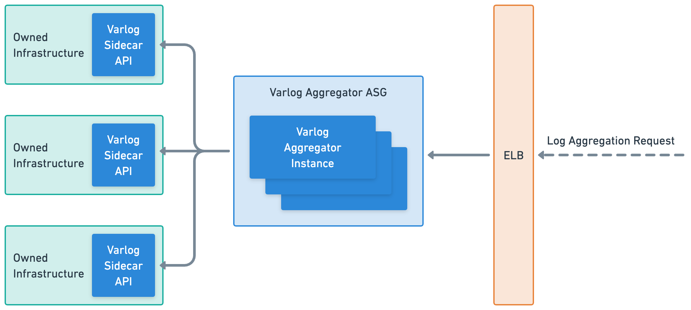
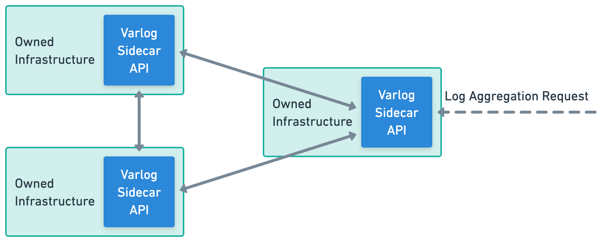

# System Design

Since Varlog can be started as both a sidecar and an aggregator, it is suited 
well for both large and small applications. This section includes two potential
architecture setups, each with its own unique benefits.

Both of these architecture setups are designed to be highly scalable and flexible,
allowing users to tailor their log management process to meet their specific needs.
Users can easily manage their log data, troubleshoot issues, and ensure that their
applications stay up and running smoothly.

## Aggregator Architecture

The first is the aggregator architecture, which is ideal for enterprise-grade
applications with a large number of different services running. This architecture
features an auto-scaling group of Varlog aggregator instances which are responsible
for aggregating logs from sidecar API instances. The aggregator Varlog servers are
highly scalable and can handle large amounts of log data, making them a great choice
for organizations with complex and highly distributed systems.

While the aggregator architecture is a great choice for enterprise-grade applications
with a large number of different services running, it may not be the best option for
smaller users who have fewer servers to manage. This is because the setup and maintenance
of an auto-scaling group of Varlog aggregator instances can be complex and
time-consuming, and may not be necessary for smaller-scale log management needs.
Additionally, the added complexity of the aggregator architecture will increase the
cost of operation and may not provide enough added value for smaller users who can
benefit from the simplicity and flexibility of the mesh network architecture.

## Mesh Network Architecture

The second potential architecture setup is the mesh network architecture, which is
perfect for smaller users who only have a few servers. In this architecture, each
sidecar also acts as an aggregator, allowing any sidecar to be queried for logs
from all other instances. This setup is highly flexible and allows users to quickly
and easily access their logs without the need for a centralized log management system.

Since the mesh network architecture provides a simple and flexible option
for smaller users, it may not be the best choice for larger, enterprise-grade
applications with a larger number of different services running. One of the main
reasons for this is that the mesh network architecture can become more difficult to
manage as the number of servers increases. Paradoxically, this can also lead to higher
operational costs and may require more time and resources to ensure that all nodes
are properly configured and functioning correctly.

Additionally, the mesh network architecture may not provide the same level of
performance and scalability as the aggregator architecture for larger applications.
As the number of logs and requests increase, the mesh network may become overwhelmed
and unable to provide the necessary level of responsiveness and speed that is required
in enterprise-grade applications.

---

In this section, we've discussed the two possible architecture setups of Varlog,
highlighting the benefits and trade-offs of each. The aggregator and mesh network
architectures both provide distinct advantages depending on the scale and complexity
of the application. In the next section of the documentation, we'll dive deeper into the
trade-offs and design choices that were made while building Varlog. By examining the
decision-making process, the goal is to provide readers with valuable insights and
lessons learned that can be applied to their own projects.
